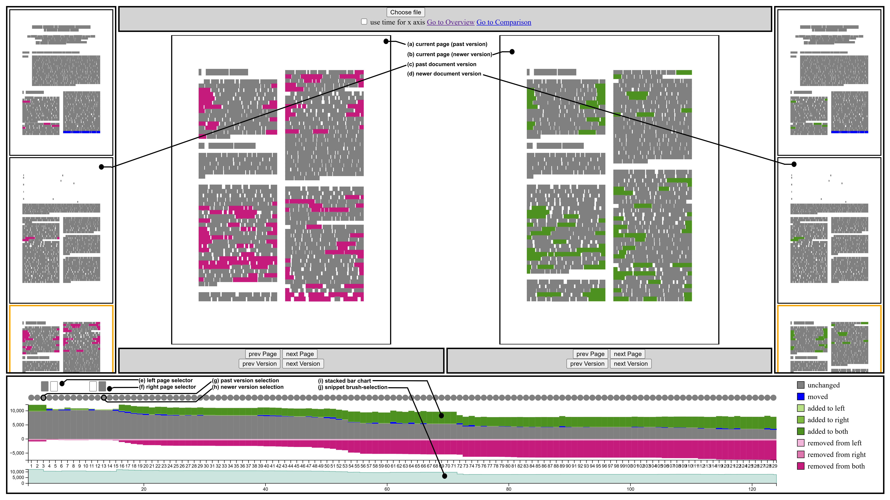

# Overview

This repository contains the demo code for the work ''Visual Analysis of Document Editing Patterns'' by Satkunarajan et al. [[1]](#ref1).

We introduce an visual-interactive approach to temporal and structural analysis of document writing patterns that is text-agnostic. 

The approach comprises two views: the **Temporal overview**, which shows different temporal aspects of the underlying data. And the **Detail-view** which enables the close inspection and comparison of document snapshots.
The approach utilizes a history of the document editing process for the visual representations. We create the history by tracking the token-level changes in the document during the editing process. A token-level change we define as a new addition, a removal or positional change of a token. 
We create a **document snapshot** for every single token-level change by comparing consecutive document instances.
A PDF document is creates for every document snapshot. The approach preserves and recreates the PDF layout for its visualizations.

# Usage

**Prerequisites**
- Node.js installed
- Data available locally (ask the authors if you need data)

**To run the code** 
- navigate into the project folder
- type and execute npm run dev
- app is opened on localhost:8000
- explore!

# Demo video

**tbd**

# References
 [1] tbd.

# Special Thanks

This code is originally written by and based on the Bachelor Thesis of Josia Rieß. His bachelor Thesis can be found at https://elib.uni-stuttgart.de/server/api/core/bitstreams/7cd5bd60-ef6c-4b55-9649-76f2a9f5f1cf/content.
